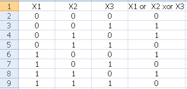

# Note

## Example neural network 2 layers

Use AI to calculate the logic `X1 or X1 xor X3`



In file __'tensorflow_2_layer.py'__, you can edit the root path and dataset file at line 8 and 9

```
csv_dir = 'D:/MyProject/machine-learning/Neural network' 	# your root path of a dataset	file		
df = pd.read_csv(os.path.join(csv_dir, 'example_2_layer.csv'), dtype=np.float32) 
```

## Example: AI paint a picture

Inspiration: http://cs.stanford.edu/people/karpathy/convnetjs/demo/image_regression.html

