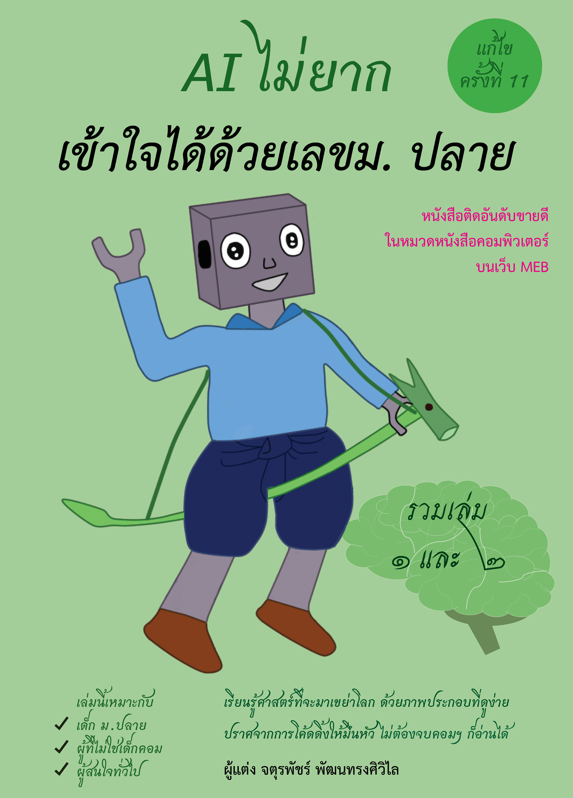
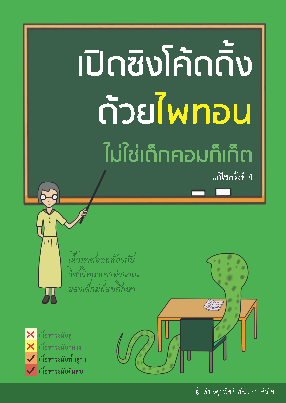

The project will be updated continuously ......  :fire:

# Machine learning + Deep learning examples

For many years, I have studied Machine Learning and practiced coding. This repository has published my source codes.

## Requirement

All examples are written in Python language, so you need to setup your environments as below 

* First, install [ANACONDA](https://www.continuum.io/downloads)

* Install TensorFlow from PyPI with the command

`pip install tensorflow`

* Install Keras from PyPI with the command

`pip install keras`

*** I used 2 library including [TensorFlow](https://www.tensorflow.org/) and [Keras](https://keras.io/) for deep learning examples

* Install [tqdm](https://pypi.python.org/pypi/tqdm) to make my loops show a smart progress meter 

`pip install tqdm`

* Download [FFmpeg](https://www.ffmpeg.org/download.html) (I used it to generate mpg.4) and install it. [some examples]

## Table  of Content
|Title|Code Examples|
| -    |         -      |
|Beginer| [see](#beginer) |
|Machine learning/Deep learning (Basics)   |[see](#machine-learningdeep-learning-basics)|
|Computer Vision     |[see](#computer-vision)|
| Natural Language Processing(NLP)| [see](#natural-language-processingnlp)|
| Speech, Audio, Music   |[see](#speech-audio-music)| 
| Miscellaneous|[see](#miscellaneous)| 

## My examples (not yet) 

### Beginer
* 📕 [Notebooks] 
* 🐍 Python
  * Python in Mathayom_1_2_3: [ทบทวนภาษา Python ของเด็กม.1,2,3 ในวิชาวิทยการคำนวณ](https://colab.research.google.com/drive/1Eg-jsOzNzN8M0g35dvDT1ryem7RuDGYQ?usp=sharing)
  * Python in Mathayom_4_5_6 

* Lecture: IS461 Tools for Data Analytics at Thammasat Business School (IBMP), Thammasat University
   * [Data Basics and Introduction to Numpy](https://colab.research.google.com/drive/1kV4_vASlIVqtpkfQSm4VB7oTeofjhbBQ?usp=sharing)
   * [Data Manipulation with Pandas](https://colab.research.google.com/drive/1_CZ_Yiq3ihLpnOl0QlxFUZmTqoYeHeW2?usp=sharing)
   * [Data Visualization and Matplotlib](https://colab.research.google.com/drive/1K_YLTNrwNzDB-179pigpsbacW6U21aEk?usp=sharing)
   
* 📊 [Matplotlib](https://colab.research.google.com/drive/10h6_-LF8wvvDgNWWOiUkTMN5djFP2feA?usp=sharing)
* 📊 [Seaborn]
* 🧮 [numpy](https://colab.research.google.com/drive/1TLjprnOV67j9hUw5_bHaTKVxRldQscov?usp=sharing)
* 🐼 [Pandas](https://colab.research.google.com/drive/1RPzUlaMdnJMaZPaxxJ4atu_l1Hq2SFRk?usp=sharing)
* 🔥 [Tensorflow](https://colab.research.google.com/drive/1h52TQUk6IElRBN_3tqyniyXZzoHc4R9p?usp=sharing)
* 🔥 [PYTorch](https://colab.research.google.com/drive/1jAV8nvhDP24uhPT1Jmgg6r6t46jVOx9Q?usp=sharing)
* 🔥 [Keras]  
* [Prepare datasets](Prepare_datasets)
  * Getting dataset examples with Keras library.
  * Getting dataset examples with scikit-learn library.
* [Activation function](Activation_function)  

### Machine learning/Deep learning (Basics)

* 🔥[Basic Machine learning](https://colab.research.google.com/drive/1ZRMW3fXGWUvkeFPM07qtFXoSbLmuMpO1): Regression, Logistic Regression, Decision Tree, Support Vector Machine (SVM), Naive Bayes, KK-N (K-Nearest Neighbors), Kmeans etc
* 📈 [Linear and nonlinear regression](Linear_regression)
  1. Predicting food truck.
  2. Predicting house price.
  3. Predicting Thailand population history.
  4. Predicting average income per month per household  of Thailand (B.E 41-58).
  5. Predicting Boston house-prices.    
* 📉 [Logistic regression](Logistic_regression)
* 🧘‍♂ [Principal Component Analysis](https://colab.research.google.com/drive/1FoGtB5xW1aWeQ7hlTmuB1AhXuFMx-jTo)
* 📄 [Text classification](Text_classification)
* ✂ Classification
  1. [Classification and Clustering (compare between KK-N and K-means)](https://colab.research.google.com/drive/1B7ZxRDs3x3CsitI49xY7l3pWFYYJYsvB)
  2. [Naive_Bayes]()
* 🌳 [Decision tree & Random Forests]
* [Gaussian Processes (GP)]
* [Graph Neural Networks (GNN)]
* [Genetic algorithm](Genetic_algorithm): Computing the optimal road trip across 20 provinces of Thailand.
 * 🔍 [Attention]
* ⛓ [Neural network (multilayer perceptrons) paints an image.](Art_example)
* ⛓ [Neural network](Neural_network)
  * Calculating the logic.
  * Classifying the elements into two groups (binary classification).
* 🔮 [Autoencoder](Autoencoder)
* 👀 [Convolutional neural network](Convolutional_neural_network)
* 📈 Graph Neural Networks
* 📝 [Recurrent neural network](Recurrent_neural_network)
  * Showing AI writing HTML code, article and Thai novel.
* 👥 [Generative adversarial network](Generative_adversarial_network)
* 🔢 [MNIST example](https://colab.research.google.com/drive/1KsGnaw9jE4wnmXK2mf2C4-Ylnj6nXbFw): showing 9 learning techniques to recognize handwritten digits including (using MNIST database of handwritten digits)  
  1. Nearest neighbors
  2. Support vector
  3. Logistic regression 
  4. Multilayer Perceptron (MLP)
  5. Convolutional neural network (CNN) with Convolution2D
  6. Convolutional neural network (CNN) with Convolution1D
  7. Recurrent Neural Networks (RNN)
  8. Long short-term memory (LSTM)
  9. Gated Recurrent Unit (GRU)
* 👬 Siamese Neural Network

### Computer Vision

* 📸 [ImageNet classification](ImageNet_example): showing how to use models including (Convolutional neural network or CNN) 
  1. Xception
  2. VGG16
  3. VGG19
  4. ResNet50
  5. InceptionV3
* 📹 Object Tracking
* 📸 Object detection & Segmentation
  1. [imageai library](https://colab.research.google.com/drive/1uQnZfPlRhplvcZKWiXn1jeytJIFEVLkV)
  2. [pixellib library](https://colab.research.google.com/drive/1llWzReE3rS9wDfSGGm8M7RQ25jeEfSIi)
  3. [Tensorflow Example](https://colab.research.google.com/drive/12K-4uQ1tAvOukLb1-lwXx4bnXkeQupTk)
  4. [Mask RCNN](https://colab.research.google.com/drive/1JGRIMQ1YSdMXkEZdC6QNGbI722tEQJTE)
  5. [Detectron2](https://colab.research.google.com/drive/1jnWFADFdZHz1LSyfXVKHY3fIwuY5F_uo)  
* 🤸‍♀ [Pose estimation](https://colab.research.google.com/drive/1zWplcKN6ElL1eJmwKj3IqGFy3gg9Neus)
* ✋ Hand Pose Estimation
* 👆 Finger Detection
* 😃 [Face Recognition](https://colab.research.google.com/drive/1MnypOHemKhMEXCaWOgm6-ViYqF7GENWH)
* 😃 [OCR](https://colab.research.google.com/drive/11RPwkNX-L1Wi9BVni-tzvrlsHff50BOz)
* 🤣 Emotion classification
* 👳‍♂ Deepfake
   * [Face Swap](https://colab.research.google.com/drive/1k2ieb4_iicnFrn7ka14-E165VC4023Kd)
* 📹 [Porn detection](https://colab.research.google.com/drive/1aFQgXH9WAvA_aJiZU4GZppWrLnZNJ7Hh)
* 🖼 Colorizing
* Lane road detection
  * [Highway-lane-tracker](https://colab.research.google.com/drive/15dZ1Zt_TCsCsL5oqfLcSfSj-aYWmSuTi)
* 🖼 [Detecting COVID-19 in X-ray images](https://colab.research.google.com/drive/11ohI5nJiLVc23t2LRUfUmOYBvPYHJDnX)
* 📰 Image Captioning
* 🖌 Image Generation
* 🎬 Action Recognition
* 📸 Super Resolution
* 🙋‍♂ [Detect 2D facial landmarks in pictures](https://colab.research.google.com/drive/1MDRYnhhPb2l3w0QIjV9beuc26Ng5BOPc)
* 👩 [Detecting Photoshopped Faces by Scripting Photoshop](https://colab.research.google.com/drive/1y4zN4AHhx0NYYx7szfW6C5aWsFdZZvml)
* 😷 [Detect people who wearin a mask?](https://colab.research.google.com/drive/1G5q8PpsWG-VLdHNbChwonSiLgkPPftOm)

### Natural Language Processing(NLP)
* 📰 [Tudkumthai](https://colab.research.google.com/drive/1tLrKRFR6i4TAzrbJ8wgsp4aihfWnMgnT) that libraries including
  1. thai-word-segmentation
  2. Deepcut
  3. Cutkum
* 📝 [Word Embeddings]
* 🎤 [Language Models: GPT-2](https://colab.research.google.com/drive/1lZoaSLo2Ip-mlBNUFpjKhVAPWDenbRCu)
* [seq2seq]
* 🔍 Machine Translation (MT)
* 🤖 Conversational AI (chatbot)
* 🔖 Text Summarization
* ❓ Question Answering (QA)
* 💬 Named Entity Recognition (NER)
* 📖 Text Classification
* 🗣 Google Translate API
  1. [Python example](https://colab.research.google.com/drive/1aca28YHet8DZ3jw-3wCx-Y40XR-6hpDJ)
  2. [JavaScript exmample](https://github.com/adminho/javascript/blob/master/examples/google_translate/translate_general.html
)

### Speech, Audio, Music
* 👨‍🎤 Speech Recognition (use Google API)
  1. [Use javascript+HTML](https://github.com/adminho/javascript/tree/master/examples/speech-recognition/web)
  2. [Use speech to control a game](https://github.com/adminho/javascript/tree/master/examples/speech-recognition/game)
  3. Example for python
* 🎧 
* 🎶 Music Generation
* 🔊 [Speech to Text with Thonburian Whisper](https://colab.research.google.com/drive/1_dgg2GVP9BzDUZe6JSwOG05X0UPl_P71?usp=sharing)
* 🔊 Speech Synthesis
   * [Real Time Voice Cloning](https://colab.research.google.com/drive/1BmiqJkg_lAppvIJbF7QhJpSTsbjvhiK1)
   * 
### Miscellaneous
* 🛒 [Recommendation Systems]
* 🖼 [Artistic style](Artistic_style)
* 🕵️ Anomaly Detection	
* ⏰ Time-Series	
* 🏘️ Topic Modeling
* 💪 [Deep Q Learning] (in progress)
* 🐝 Transformer Networks
* 🎯 One-shot Learning
* 💻 [Pix2Code](https://colab.research.google.com/drive/1i1CeQoS8LXTkQFn08Z4aFV8BNwF8eNjZ): Generating Code from a Graphical User Interface Screenshot
* [🔐 Privacy]
* 🐙 Causal Inference
* 🦠 Survival Analysis
* 🌅 [Remove Image Background](https://colab.research.google.com/drive/1n1s30OAeNeC6UNmNk2wPxL-e2gkF3-cu)
* 💧 [Trading in Thailand Stock: ตัวอย่างการเอา AI มาใช้ในตลาดหุ้นไทย](https://github.com/adminho/trading-stock-thailand)
* 👨‍🎓 [AI for Thai:AI สัญญาชาติไทยใช้ง่ายไม่ยาก จากทีมนักวิจัยของ NECTEC ปัจจุบันให้บริการผ่านเว็บเซอร์วิส ](https://colab.research.google.com/drive/1LRPpzzwJwLIZIy3t7CxljhDjgLq-Z1Ha)
  1. BASIC NLP: ประมวลผลภาษาไทย
  2. TAG SUGGESTION: แนะนำป้ายกำกับ
  3. MACHINE TRANSLATION: แปลภาษา
  4. SENTIMENT ANALYSIS: วิเคราะห์ความคิดเห็น
  5. CHARACTER RECOGNITION: แปลงภาพอักษรเป็นข้อความ
  6. OBJECT RECOGNITION: รู้จำวัตถุ
  7. FACE ANALYTICS: วิเคราะห์ใบหน้า
  8. PERSON & ACTIVITY ANALYTICS: วิเคราะห์บุคคล
  9. SPEECH TO TEXT: แปลงเสียงพูดเป็นข้อความ
  10. TEXT TO SPEECH: แปลงข้อความเป็นเสียงพูด
  11. CHATBOT: สร้างแช็ตบอต

## Cite
* https://paperswithcode.com/
* https://github.com/keras-team/keras/tree/master/examples
* https://github.com/madewithml/lessons

## Note
✍ ผมเคยโน๊คเลคเชอร์วิชาพวกนี้เอาไว้ เผื่อมีใครกำลังเรียนอยู่  หรือสนใจเอาไว้ทบทวนได้ครับ

1. Neural Network
2. Convolutional Neural Networks
3. Recurrent Neural Network (RNN), Long Short-Term Memory (LSTM)
4. GAN: Generative adversarial networks
5. RL: Reinforcement learning(รอก่อน)

[คลิกเข้าไปดูได้](https://www.facebook.com/share/p/fGzieBbXfG3YVTeu/)

## ขออนุญาตประชาสัมพันธ์ (แอบขายของ)
ท่านใดสนใจซื้อ "หนังสือ AI ไม่ยาก เข้าใจได้ด้วยเลขม. ปลาย" 
อธิบายด้วยเนื้อหาคณิตศาสตร์ง่ายๆ ในระดับม. ปลาย ที่ไม่มีโค้ดดิ้งให้ปวดหัว

### ตัวอย่างแต่ละบท

[ตัวอย่างสารบัญ](https://drive.google.com/file/d/1wgoanr4CsswsWeqBQq0O-OYECLb2sdgB/view?usp=sharing)

|ตัวอย่างส่วนที่ 1|ตัวอย่างส่วนที่ 2|
| -    |         -      |
| [บทที่ 1, 3, 4](https://drive.google.com/file/d/1wgoanr4CsswsWeqBQq0O-OYECLb2sdgB/view?usp=sharing) | [บทที่ 8, 9, 10](https://drive.google.com/file/d/1ANlGwauHUwk-zcF5vNBclyKu-krs97AV/view?usp=sharing) |

### เอกสารประกอบหนังสือ
* เอกสารประกอบบทที่ 1 พร้อมทั้งประกอบหนังสือ "หัดโค้ดดิ้งตั้งแต่ติดลบด้วย Python"

  
|แหล่งเรียนรู้ Python ออนไลน์|
| -    | 
| [คอร์สสอนวิชาการเขียนโปรแกรมสำหรับนิสิต ปี 1 คณะวิศวกรรมศาสตร์ ภาคปลาย ปีการศึกษา 2558 รหัสวิชา 2110101 Computer Programming สอนโดยดร. สมชาย ประสิทธิ์จูตระกูล ใช้ Python](https://www.youtube.com/playlist?list=PL0ROnaCzUGB4ieaQndKybT9xyoq2n9NGq) | 
| [วิดีโอสอนภาษา Python โดย SIPA](https://www.youtube.com/watch?v=KcAX613khH4&list=PLtM3znnbMbVWZ1ICKEi7Gr9dxdJc_ppel) |
| [วิดีโอสอน Python โดย Clique Club - ชมรมคลิก ของจุฬา](https://www.youtube.com/playlist?list=PLVcky7_Sy_7ltVaI1WVIWDvit_DtgUYBw) | 
| [วิดีโอสอน Python โดย รศ. ดร. ประเสริฐ คณาวัฒนไชย จากจุฬาฯ](https://www.youtube.com/playlist?list=PLoTScYm9O0GH4YQs9t4tf2RIYolHt_YwW) | 

|หนังสือ Python แจกฟรี|
| -    | 
| [หนังสือเชี่ยวชาญการเขียนโปรแกรมด้วยไพธอน โดย ผศ. สุชาติ คุ้มมะณี](https://drive.google.com/file/d/1_xvEhRquLeZJbLLKrK1e5liJdb_HDEBH/view) | 
| [หนังสือสอนเขียนโปรแกรมภาษา Python ใช้ประกอบการเรียนวิชา 2110101 Computer Programming ของวิศวกรรมคอมพิวเตอร์ จุฬาฯ โดย กิตติภณ พละการ, กิตติภพ พละการ สมชาย ประสิทธิ์จูตระกูล และ สุกรี สินธุภิญโญ](https://www.cp.eng.chula.ac.th/books/python101/) | 

|แหล่งเรียนรู้อื่นๆ|
| -    | 
| [แหล่งเรียนรู้ฟรีด้าน AI, Machine learning]( https://www.patanasongsivilai.com/blog/sdm_downloads/source-free-ai-machine-learning/) | 

* เอกสารประกอบบทที่ 3 สอนคอมให้ฉลาดทำได้อย่างไร (ปูพื้นฐาน machine learning)
   * [ตัวอย่าง 3.5.3 ข้อมูลเป็นรูปภาพ](https://drive.google.com/file/d/1F7L10ii719wVIuoO_NwOmxazXcjTxE40/view?usp=sharing)
* เอกสารประกอบบที่ 7 เซลล์สมองเทียมเลียนแบบ (Neural Network)
   * [พิสูจน์ที่มาของการทำ backpropagation](https://drive.google.com/file/d/1X47DN-U850JguOfTiZ0_-9ZCtlc_6caw/view?usp=sharing)
* เอกสาประกอบบทที่ 8 เบิกเนตร เสกดวงตาให้ AI -> Convolutional Neural Network (CNN)
   * [หัวข้อ 8.7 Convolution กับภาพสี](https://drive.google.com/file/d/1l7nCCjO5KWbCYN_1wsB22rLdlDPPHH2G/view?usp=sharing)

### โค้ดตัวอย่าง (Python) ประกอบหนังสือ
เอาไว้อ่านประกอบหนังสือ "AI ไม่ยาก ทั้งเล่ม 1 กับ เล่ม 2"

#### บทที่ 3 ถึง 6
* บทที่ 3 สอนคอมให้ฉลาดทำได้อย่างไร (ปูพื้นฐาน machine learning)
* บทที่ 4 เส้นตรงพยากรณ์ (Regression)
* บทที่ 5 สมการแม่หมอโฉมใหม่ (Regression แบบหลายฟีเจอร์)
* บทที่ 6 แว่นวิเศษพยากรณ์ (Logistic Regression)

[ตัวอย่างโค้ดบทที่ 3, 4, 5 และ 6](https://colab.research.google.com/drive/1-rzF06JtujgzWGB6keohDShDcuJOAFaf?usp=sharing)

#### บทที่ 7 ถึง 9
* บทที่ 7 เซลล์สมองเทียมเลียนแบบ (Neural Network)
* บทที่ 8 เบิกเนตร เสกดวงตาให้ AI -> Convolutional Neural Network (CNN)
* บทที่ 9 สำเหนียกรู้ ดูข้อมูล เป็นชุด -> Recurrent Neural Network (RNN), LSTM (LSTM (Long short-term memory), GRU (Gated recurrent unit)

[ตัวอย่างโค้ดบทที่ 7, 8 และ 9](https://colab.research.google.com/drive/1plsr_ff303-617huXDINCkfwZ-58SoK7?usp=sharing)

#### บทที่ 11 จะมีหลายตัวอย่าง

* [Autoencoder](https://colab.research.google.com/drive/16QcNEBnreLsSdU-cIDrfAVo59KInaJ8l?usp=sharing)
* [Generative Adversarial Network (GAN)](https://colab.research.google.com/drive/1iis6NQMXnmYvzcznD-38VlN6kPmf9-hc?usp=sharing)
* [Siamese Network](https://colab.research.google.com/drive/1mYnZwOSDnWsVJwFRKmhAgZUv3XsiLdyk?usp=sharing)
* [Sequence-to-Sequence (Seq2Seq)](https://colab.research.google.com/drive/1pE1ITTaZBnLfgwtslNnMFfc84_QxbeJ2?usp=sharing)
